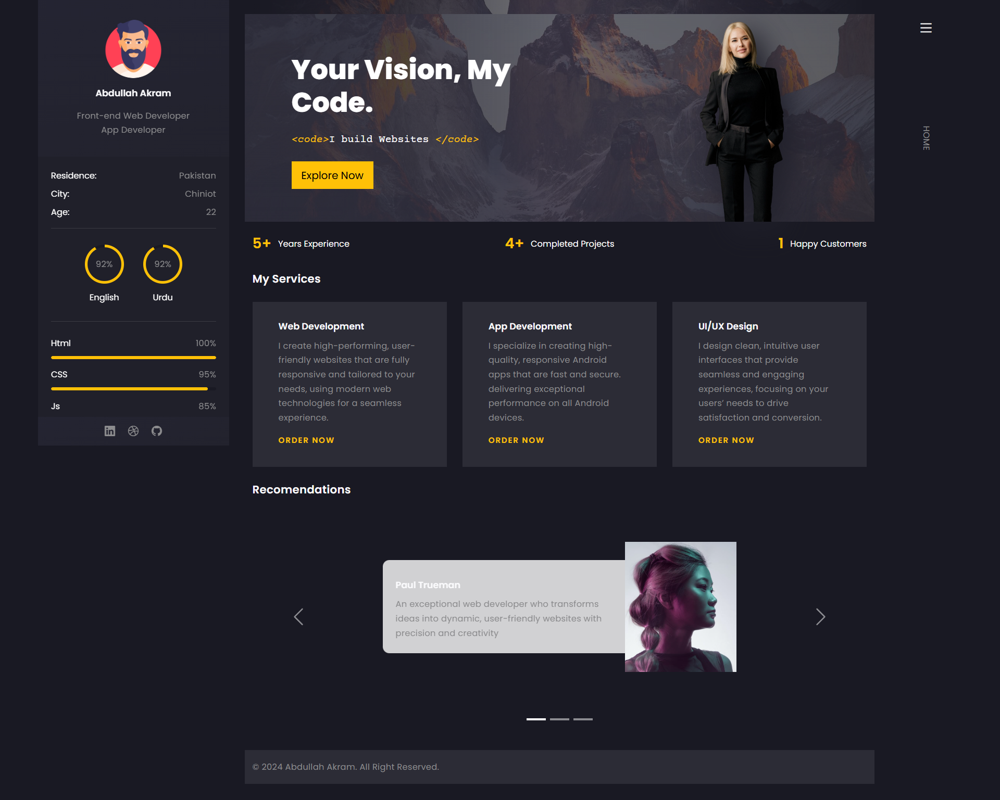

# 🌐 Abdullah Akram – Portfolio Website

---

## 👋 About Me
Hi, I'm **Abdullah Akram**, a **Front-end Web Developer** and **Android Developer** passionate about building visually appealing, high-performing, and user-friendly websites and Android apps.

This portfolio showcases my **skills**, **projects**, and **services** — all crafted with modern web technologies and a clean UI/UX approach.

---

## 🌐 Live Preview
**Visit Website:** [Portfolio Website](https://abdullah-akram-developer.github.io/Portfolio/)

---

## 🚀 Features
- 🖥️ Responsive & modern design  
- 💡 Built using **HTML, CSS, JavaScript, Bootstrap 5**  
- ⚙️ Clean and structured codebase  
- 📱 Includes Android development services  
- 🧭 Dynamic navigation with sticky sidebar  
- 💬 Interactive testimonials carousel  
- 📩 Contact form ready for integration  

---

## 🧰 Tech Stack
| Technology | Purpose |
|-------------|----------|
| **HTML5** | Structure |
| **CSS3** | Styling and layout |
| **Bootstrap 5** | Responsive grid and components |
| **JavaScript (ES6)** | Interactivity |
| **Google Fonts (Poppins, Courier Prime)** | Typography |
| **Bootstrap Icons** | Icons and symbols |

---

## 🧩 Sections
- **Home:** Introduction and experience summary  
- **My Services:** Web, App, and UI/UX design services  
- **Recommendations:** Client testimonials  
- **Portfolio:** Project showcases  
- **Contact:** Get-in-touch form and personal information  

---

## 📸 Screenshot

---

## 💬 Contact

📧 **Email:** [Email Me](mailto:m.abdullahakram01@gmail.com)  
🌍 **Website:** [Portfolio Website](https://abdullah-akram-developer.github.io/Portfolio/)

---

## 👨‍💻 Developer

**Abdullah Akram**  
📍 Pakistan  
💻 Android & Web Developer  
📧 [Email](mailto:m.abdullahakram01@gmail.com)  
🔗 [GitHub](#) 

---

⭐ **If you like this app, please give it a star on GitHub!**

---

## 📄 License

This project is for **personal or educational use only**.  
© 2024 The Amazing Minds. All Rights Reserved.
